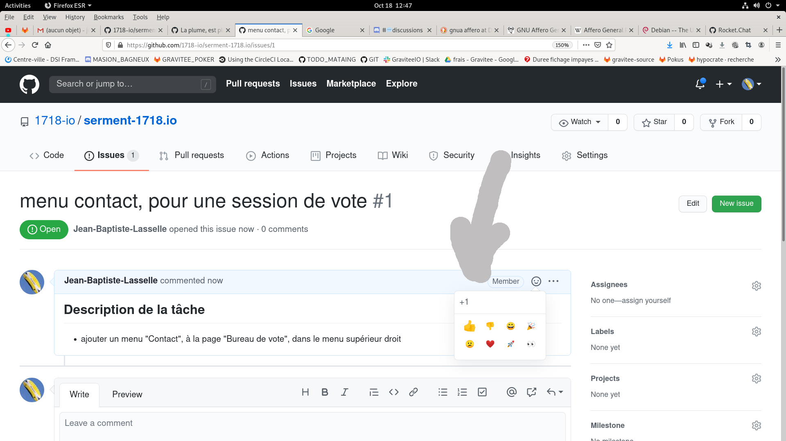
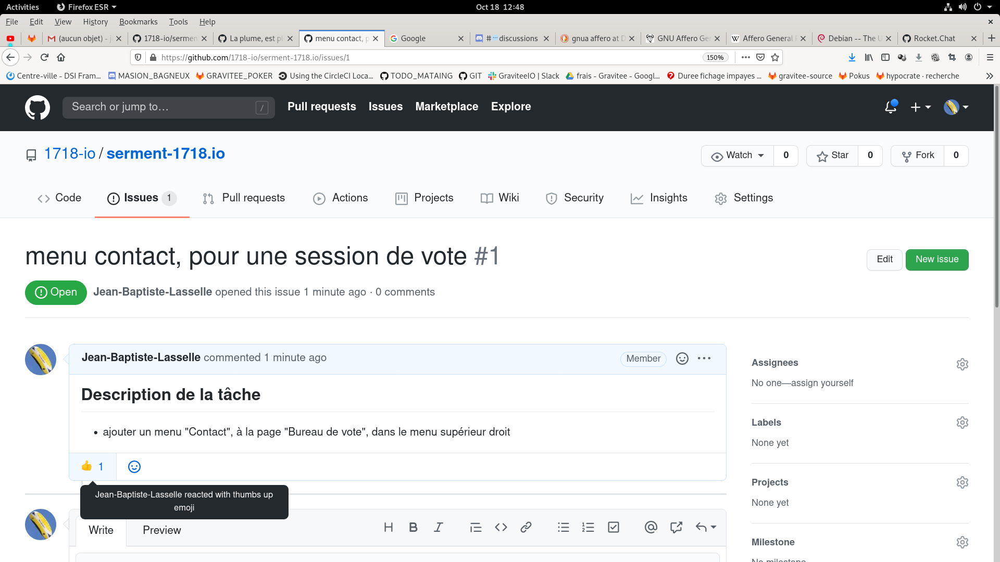
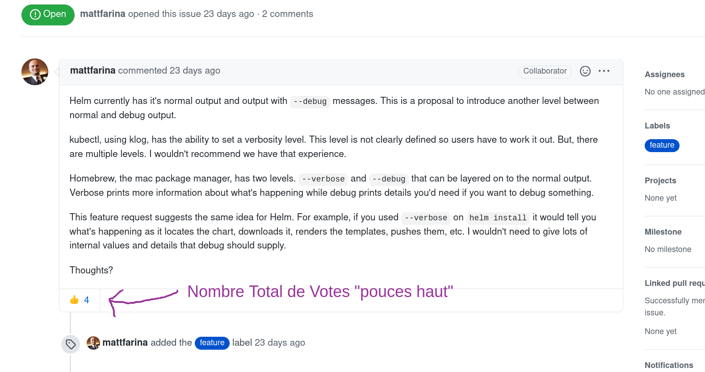

# Qui suis-je ?

Je m'appelle Jean-Baptiste Lasselle. Mon activité professionnelle consiste à :
* Utiliser mes connaissances en matières de sciences et technologies de l'information, pour :
  * conseiller une entreprise en matière de technologies de l'information : ces technologies qui n'ont eut de cesse de se développer depuis qu'[Alan Turing](https://en.wikipedia.org/wiki/Alan_Turing) a créé le concept du, et le premier Ordinateur. Disons que pour le résumer grossièmremnt, dans ces technologies, il y a du matériel (entre autres choses,"tout ce qui a un processeur"), et des logiciels (exemple: Androïd, sur votre téléphone, est un logiicel, tout comme les jeux vidéos en sont, bien qu'ennuyeux). L'entreprise peut me demander de répondre à ses questions, ou réaliser des tâches concernant destechnologies qu'elleutilise, généralement les deux à la fois.
  * être employé par une société pour participer au développement d'un logiciel, qu'en général, elle vend, d'une manière ou d'une autre.
* Constamment augmenter mes connaissances en matière de sciences et technologies de l'information. Tout comme un médecin continue toute sa vie d'apprendre de nouvelles méthodes, ou autres connaissances de la médecine, utiles pour l'exercice de son métier.

# Objet et naissance

Ce document est le fruit d'une réflexion commencée il y a plusieurs années, qui a fait naître dans mon esprit, une idée.

Au fil des années, j'ai été amené, et même forcé, à chaque fois que j'ai eu l'occasion et l'envie, de parler de cette idée
qui germait dans mon esprit, à améliorer à chaque fois un peu plus, un énoncé clair, expliquant l'idée, son objet, et les
raisons de sa naissance.

Je vais donc commencer par ici faire de même. Et je commence toujours par sa naissance.

## Naissance de l'idée

#### Prémisses

2 ou 3 ans après avoir commencé à exercer mon activité professionnelle, disons entre 2009 et 2010, environ, prenant un peu de recul par
rapport à ces premières années, en discutant avec certains collègues des principales difficultés rencontrées
au quotidien (imaginez-vous ces premières annnées d'exercice sont un peu comme celles d'un jeune médecin qui
fait son internat : c'est "un petit peu de la folie furieuse"), il me vient soudain une réflexion, que j'ai exprimée ainsi :

>
> Nous sommes d'accord, ce n'est pas toujours le cas, mais :
>
> Enfin, c'est quand même dingue, de se dire que le même gars :
> * qui d'un côté, nous paie cher, tout de même, pour le conseiller, quand tu lui dis de faire "A", eh bien il vient, il te dit "oui, mais [blablabla ...]", et finit par ne faire absolument pas, du tout, ce que tu lui a conseillé de faire.
>
> * Et d'un autre côté, le même jour, ce même gars, a de la fièvre, va chez le médecin, le médecin qui l'osculte en 10 minutes, lui écrit un truc sur une feuille, (et le fais sortir 25 euros merci aurevoir), et devines ce que le gars fait en sortant ?
>    * Eh bien il va chez le pharmacien, il achète, mais **exactement** ce que le médecin a marqué sur la feuille, à la lettre près,
>    * et attends, devines ce qu'il fait en sortant de chez le pharmacien, en plus ? Eh bien il prend la pilulle bleue tous les matins, le sirop après dîner, la poudre blanche toutes les 48H, le  tout pendant 10 jours, le tout **exactement** à la lettre comme le médecin a dit !!
>
>  Mais nom de **** !?!?? Comment lesmédecins font-ils ça ?!??
>
>  Pourquoi le même gars fait exactement ce qu'onlui dit quand c'est le médecin qui le lui dit, et nous, ce qu'on dit..???
>
>  Alors que ça fait un mal terrible à son entreprise, le fait que si souvent, il ne fasse pas ce qu'on lui dit de faire !!!...
>
>   Nom de ***, de Nom de ***, attends, il y aun truc, là, comment les médecins font ça ??
>

Je vous assure, que cette anecdote fera sourire la plupart des personnes de votre entourage qui exercent dans le même corps de métier que moi, comme vous pourrez le constater.

Réfléchissant à ce problème, sous cet angle (_"Quelle est la recette magique des médecins?"_), je me fais alors une première réflexion :

Qu'est-ce que les médecins ont, que nous, dans notre métier, n'avons pas ?

Tiens, c'est marrant, il y a une chose que les médecins, ont, que nous, n'avons pas, (et qui pourtant dans notre métier serait bien utile) :
* Le secret professionnel.
* Eh oui, si on fait confiance à un médecin, c'est parce que l'on sait, que son secret professionnel, ce n'est pas "juste une promesse sur son site web" :  Non,si un médecin rompt le secret professionnel, eh bine il encourt des sanction, de son ordre professionnel, et peut-être même des poursuites en Justice. Cela est inscrit dans la Loi.
* Ah, mais oui, en effet, si nous avions inscrit dans la Loi, pour notre métier, que ... (et vous m'avez compris).
* Ah, oui, et puis ils ont le serment d'Hypocrate, et un ordre professionnel...Ok,Ok,....

Ah, tiens, c'est marrant, il y a les avocat aussi dans ce cas (le secret professionnel garanti par la Loi, l'ordre professionnel, etc...)

Voilà la toute première étape de la naissance de cette idée. Nous verrons plsu tard, qu'il y a là des éléments,mais insuffisants, pour trouver "la recette magique des médecins"

#### La communauté de l'Anneau

Les années se passent, je continue mon parcours professionnel, et je vis dans la Société Française, comme tout un chacun.

Et je ressens à titre personnel, une frustration, en tant que citoyen :

* d'une part je vois, j'entends, une majorité des gens que je fréquente, croise, au quotidien, convenir qu'il est certain, que l'avenir est sombre pour les citoyens Français, les membres de notre société. Que nous perdront de plus en plus de droits, de richesse, de possibilités professionnelles, etc., etc.... Chacun pourra allonger la liste.MAis entout cas, ce que je vois de commun, c'est que tous pensent que "tout va se dégrader, jamais s'amélirer."? Que l'avenir est sombre, etsera,deplsu en plus sombre.
* d'autre part, n'ayant jamais été défaitiste, reste constamment en moi une voix qui dit : "Bon, ok, imaginons que cesoitbien lecas, que l'avenir est sombre. Mais alors, si on le sait, ne serait-ilpas naturelde sedire qu'en conséquence, nous allons faire quelque chose, pour changer cela??"

Faisant ce constat, jemedis alors :

>
> Très bien, il y a des personnes, peu importe pour quelle(s) raison(s), avec lesquels manifestement, cela ne sertàrie de discuter, ils ne voudront pas "au moins essayer defaire quelque chose pour changer cet avenir sombre"
>
> Mais, mêmes'ils étaient minoritaires, il doit y avoirdes personnes "qui veulent faire quelque chose".
>

Avec cette conviction, j'ai donc, plusieurs années, chercher à agir, en rejoignant l'action d'autres personnes.

Et la frustration est alors venue ainsi : cela a duré des années, et qu'il s'agisse de partis politiques, ou d'associations, à chaque fois, j'en suis très rapidement venu à me dire qu'il s'agisait au mieux, de réunions sympathiques entre bon copains/copines, n'ayant aucune chance d'avoir un quelconqueréelimpact, et au pire ... Nul besoin de donner de détails, votre propre vie et imagination suffiront amplement, et surtout examiner, lister, qualifier le pire de ce qui existe, n'estpas un travailqui m'aidera à trouver un moyen d'agir concrètement.

Pour le résumer, je me sens pris au piège, et ne sais plus quoi faire, et me concentre sur ma vie professionnelle et personnelle.

Tout cela, en réalité, jel'ai vécu, et ressenti depuis le début de ma vie, au moins l'adolecence.

La seule réflexion intéressante, que j'ai conservée de cette période, est que de toute évidence, notre Société telle qu'elle est organisée, nous pousse très puissamment, constamment, implacablement, à abandonner toute action commune, ayant pour objectif de changer significativement notre destin commun.

#### Les Deux Tours

Nous sommes maintenant aux alentours de 2017, et jusqu'à aujourd'hui

Vous ne partagerez peut-être pas certaines opinion, que je vais exprimer, et je ne prétendrais pas non plus pouvoir prouver qu'une ou plusieurs de ces opinions sera(en)t partagée par une majorité de Français,

Je vais simplement exprimer ces opionins, proposer à chacun se faire la sienne, en exposant deux faits, qui ont été un tournant, pour la naissance de l'idée, dont je suis en train de vous faire la génèse.

* Le premier fait, dont je pense, vous conviendrez est le suivant : D'abord, aujourd'hui la société Française dans son écrasante majorité, convient, et est tout à faite consciente, que les technologies sont un enjeu pour l'ensemble de la société. Quelque chose qui peut changer leur vie, très concrètement, parfois violemment, parfois subrepticement, parfois pour le bien, parfois pour le mal, des citoyens. Un enjeu de pouvoir. Ilsuffit que je rappelledesépiodes comme"laquestion d'Uber(lestaxis)", pour que vous trouviez vous-même multitude d'autres exemples montrant à quel point ce pouvoir s'est déjà manifesté. Et pour que vous n'ayaez pas de malà croire que ce pouvoir ne va faire que se renforcer.
* Le second fait que je vais exprimer, en quelques points, et avec des opinions, que je vous laisse donc le soin de partager ou non :
  * Il y a eut le "mouvement des Gilets Jaunes".  Mon opinion, est qu'il y avait, non pas des dizaines, mais au moins des centaiens de milliers de personnes, dès les premières semaines, impliquées dans ces évènements.
  * Dans le même temps, j'ai à nouveau écouté (je l'avais déjà écouté quelqeus fois), amplifié par ces fameux "Gilets Jeunes" le propos d'un certain monieur Etienne Chouard :

  >
  > "Elire c'est renoncer au vote".
  >
  > "Si nous restons au niveau législatif, nous sommes tous en désacord, et si nous nous élevons au niveau Constitutionnel, comme par magie, nous arrivons à un consensus largement majoritaire."

Et voilà, d'un seul coup, celaclaque dans mon esprit :

>
> Bon sang ! Mais c'estbien sûr! la voilà, la raison pour laquelle je me ressentais cette frutstration, comme une souris dans une petite roue!!!! Eurêka!!
>

Et comme bien d'autres je me suis mis à réfléchir à ces nouvelelsidées, le RIC, etc...

Et je me demande rapidement :

>
> Très bien, maintenant que je ne suis plus une petite souris, que jai trouvé un moyen d'agir, comment puis-je aider au mieux ?
>
> Bien, sûr, c'est en apportant monexpertise professionnelle gratuitement, en aidant sur cette partie, c'est évident.
>

Alors, bien évidemment, je commence par chercher si des équipes se sont déjà formées, sur la question des technologies, je vous passe lesdétails, et vous livre la conclusio.

**À mon très grand étonnement**, et ce parce qu'il y avait des centaines de milliers de personnes (parmi ces "Gilets Jaunes"), et encore plus de sympathie de l'opinion générale :
* Il n'y a aucune équipe (même pas d'au moins 5 personnes, ne serait-ce que cela) qui ait produit un travail significatif (comparable à ce que nous faisons pour nos employeurs). Notamment, très exactement zéro "repo" sur github.com!!!
* et pourtant parmi ces centaines de milliers de personnes, il est absoluemnt certain qu'il y a au moins, si ce n'est un pourcent, disons au moins un pour mille, qui est un professionnel de mon métier :
  * cela veut dire, aller, au minimum, c'est certain, disons cinq cent (500) professionnels de mon métier, dont l'opinion personnelle est plus que favorable aux "Gilets Jaunes" .
  * 500 qui tous diraient qu'ils s'engageraient fortement, et sans tarder, pour aider.
* un bon nombre de groupes de "Gilets Jaunes", m'ont démontré, ou confirmé, qu'ils n'ont pas même réussi à créer une seule équipe "technologique". Excluant bien entendu, toute "équipe"qui aurait proposé son aide,et qui en réalité corresppond à une entreprise, une société, à but lucratif, même si elle n'a demandé aucune rémunération. Ce dernier type de "proposition" a été vu quelques fois, et n'a pas manqué de se terminer de manière... Négative, dirons-nous.

>
> Quoi?! Comment?! nous sommes au moins 500, tous les jours de la semaine, nous travaillons pour nos employeurs, avec des méthodes, des outls entièrement gratuits, extrêmement puissants, de 8H00 à 18H00, et dès que sortis du bureau à 18H00, on oubli toutes ces méthodes, ces outils, cette ingénierie, et nous n'avons pas été capables de nous organiser ?
>
> Mais enfin, Comment est-ce possible ??
>
>  Comment est-ce possible, nous qui lançons, et gérons des projets open source, nous qui sommes contributeurs Linux Debian, entièrement bénévolement ?
>

Et d'autre part :

>
> * L'Hypothèse qu'il y a, en France, à tout moment, au moins 500 professionnels exerçant la même activité que moi, prêts à s'engager pussament pour "essayer de changer les choses", ou souhaitant "se mettre au serivice de l'intérêt général, ne serait-ce que quelques heures par semaines" est une hypothèse plus que raisonnable, sans même évoquer les "Gilets Jaunes",
> * Ces 500, étant donné leur niveau d'expertise, peuvent produire un travail équivalent à une équipe "plein temps" de 50 ingénieurs. Ce qui est une équipe extraordinairement puissante, capable de choses d'une puissance, que quasi personne ne peut aujorud'hui imaginer, et dont très peu, probablement moins de 100 entreprises, en France dispose.
>

**Là, j'avais "la puce à l'oreille" : Ok, là, il y a un paradoxe, et un problème que je ne comprends pas encore, à résoudre.**

Voilà, ce qui a déclenché finalement, le travail qui a donné naissance à l'idée que je vais vous exposer.

Je donnerai simplement uneremarque que je trouve intéressante ici : ce constat, l'identification de ce paradoxe, que j'ai réalisée pour la France, j'ai aujourd'hui l'intuition, qu'il peut-être fait, concernant ce même corps de métier, dans tous les pays du Monde, à ce jour.

Nous sommes Français, après tout, le seul Peuple qui ait déclaré des droits non pour les seuls Hommes de notre pays, mais pour ceux de tous les pays du Monde.

Lorsque je fais un exposé Oral, dans une assemblée, de cette génèse, à ce point là de l'exposé en particulier, comme à d'autres précédemment, je  propose de faire un échange question / réponses (Avez-vous des questions ?)

Je le fais en particulier, pour que les membres de l'assistance, qui sont des professionnels de mon métier, émettent des objections, posent
des questions, sur l'analyse qui m'amenée à identifier ledit paradoxe :

Ainsi, lorsque l'ensemble de l'assistance, voit que mes confrères, rapidement, conviennent de la justesse de mon analyse, l'assistance toute entière, est elle-même convaincue, constatant le consensus parmi les professionnels du métier.

L'assistance sait ainsi, que mon analyse repose sur des concepts si largement admis dans notre métier, qu'ils sont incontestables.

#### Le Retour du Roy

En préambule àl'exposé de mon idée, je vais énoncer de manière concise, les quelques constations que j'ai accumulées au cours du temps. Les voici :

* Il semble que les médecins aient une "formule magique", qui fait que leur patients suivent leurs recommandations beaucoup plus rigoureusement, que nos patrons, suivent les nôtres, dans notre corps de métier (des technologies de l'information).
* La société Française dans son écrasante majorité, est consciente que les technologies de l'infromation sont un enjeu majeur de pouvoir, tout comme le pouvoir médiatique (le 7ième pouvoir)
* Lorsqu'un mouvement majeur de Citoyens Français, se constitue, pour une cause commune, un paradoxe apparaît :
  * Il est statiquement certain, qu'un nombre significatif de professionnels des technologies de l'information, adhèrent à la cause du mouvement, et travailleraient volontiers bénévolement.
  * Et pourtant, aucune organisation d'équipe "technologique", même petite, ne se constitue.
* J'ajouterai que le constat fait pour le cas d'un mouvement majeur de Citoyens Français, s'applique encore plus durement, à un grand nombre d'associations à but non-lucratif, qui chacune indépendamment, essaient de faire avancer une question particulière,  dont la plupart des Français ne pourraient penser "que du bien". Par exemple, la condition des non-voyants dans la Société Française, et je suis certain que vous trouveriez des dizaines d'exemples en quelques minutes.

_Dans un premier jet de rédaction, je me suis proposé par exposer mon idée "à l'envers", expliquant d'abord les raisonnements qui m'ont amené à l'idée condensée, épurée, pour démontrer comment celle-ci permetd'expliquer ces constations, et ce paradoxe.

Il m'est alors apparu évident que cette approche n'était pas la bonne. Aussi dans cette nouvelle rédaction, je vais d'emblée présenter cette idée, pure, distillée.

Pour laisser dans une annexe, le développement de mes raisonnements: au cours d'un exposé, d'une discussion publique, je détaille les éléments de ce raisonnement, un par uns seulement lorsque les questions etobjections de l'assistance le nécessite.
_

L'ensemble de ces constations peut s'expliquer par l'idée que je vais expliquer en l'exposant "à l'envers" : je vais d'abord montrer comment cette idée résoud le paradoxe déjà plusieurs fois mentionné, pour ensuite dévoiler pleinement cette idée, son concept.

_**Résolution du paradoxe qui n'en est un, qu'apparrement**_

D'abord, quelques éléments très concrets, les uns après les autres, qui expliquent pourquoi le "paradoxe" évoqué apparaît, et
permettent de déuire que la solution  (à chaque point, je sollicite les questions de l'audience, je note les questions, et y
répond une fois la liste de points terminée) :

* Les professionnels de mon corps de métier ne s'engageront jamais bénévolement, pour l'intérêt général, sur un projet, tant qu'il existe le moindre doute, que celui-ci puisse donner lieu à un profit lucratif, financier, à quiconque :
  * Tous les (composants) logiciels produits doivent donc être librement accessibles par tout Citoyen Français, "open-source",
  * et qui plus est, sous licence [GNU GPL v3 Affero](https://www.gnu.org/licenses/agpl-3.0.en.html), la seule licence au Monde, qui garanti qu'il est impossible de tirer profit financier du travail produit.
* Les professionnels de mon corps de métier ne s'engageront jamais bénévolement, pour l'intérêt général, sur un projet, tant que ce projet est sous le contrôle d'un individu particulier :
  * il faut donc que ce projet soit sous le contrôle d'une organisation et non d'un individu.
  * de plus, cette organisation ne peut être qu'une association dont les statuts explicitement, spécifient son but non-lucratif.
* Les professionnels de mon corps de métier ne s'engageront jamais bénévolement, pour l'intérêt général, sur un projet, tant que ce projet est sous le contrôle d'un individu particulier, et encore moins d'un ou plusieurs membres de notre corps de métier. Cela signifie qu'aucun des éléments suivants, ne peut être la propriété, ou contrôlé, juridiquement, par un ou plusieurs membres de notre corps de métier (ou d'une association à but non lucratif qu'il aurait créé, ou dont il serait membre) :
  * le logicel produit, devra être publié sur https://github.com, dans ce que l'on appelle, une "organisation Github" : c'est un peu comme "un groupe facebook", danslequel au lieu de "discuter, envoyer des posts", les ingénieurs travaillent, sur le logiciel.
  * le logicel produit, devra avoir un nom, et lui sera associé un nom de domaine public sur internet : cet élément est très important, vital, même, car c'est le seul moyen pour un tel logiciel, d'être accessible, par n'imorte qui, autrement dit d'avoir la moindre existence.
  * le nom de domaine (internet), et l' "organisation github" devront donc être sous le contrôle total, et la propriété juridique d'une association Loi 1901, à but non-lucratif.
* Un professionnel de mon corps de métier ne s'engagera jamais, ou difficilement, pour l'intérêt général, bénévolement, sur un projet, tant qu'il y aura un membre de notre corps de métier, qui sera son supérieur hiérarchique (qui pourra lui impsoser sans recours possible, des décisions) :
  * Cela est compréhensible, parce que l'image dans notre métier est très importante : être supérieur hiérarchique (avorile pouvoir de décisionen dernier recours) d'une équipe, représente un intérêt professionnel conséquent, surtout pour des projets "open-source", ce qui constitue **un conflit d'intérêt**, avec l'intérêt général.
  * De plus, il existe un cas légitime, reconnu par tous, pour lequel un professionnel de notre coprs de métier peut vooir son image profesionnelle bénéficier du travail qu'il fait bénévolement :
    * en faisant autorité, non parce que décideur en dernier retour, pour une équipe, mais parce que son avis, ses recommandations, et son exepertises, sont beaucoup sollicitées parsa propre équipe.
    * en faisant autorité, non parce que décideur en dernier retour, pour une équipe, mais parce qu'il a produit un travail reconnu de qualité, ou relevant d'une très bonne idée,
  * Dans un grand nombre de cas, le propriétaire de la société / l'entreprise qui nous emploie, n'est pas un membre de notre corps de métier.
  * Pour toutes ces raisons, il est donc essentiel, pour favoriser la croissance d'une équipe, et un projet d'intérêt général, que soit garanti juridiquement, à tout nouvel arrivant, qu'aucun membre de son corps de métier, n'aura, et ne pourra avoir de rapport hiérarchique avec lui.
  * Ainsi, lorsqu'un professionnel de notre métier est membre d'une association contrôlant des projets technologiques, il a l 'obligation de faire un choix, définitf (à vie, pour cette association) :
    * soit il contribue techniquement au projet, mais alors renonce "ad vitam eternam", à sa qualité de membre de l'association, et à tout don (financier), à celle-ci.
    * soit il conserve sa qualité de membre de l'association, et alors est exclut de toute participation à un quelconque projet de technologies de l'information que contrôle l'association. Ilreononcede plsu à exprimer une quelconque opinion de professionnel/expert, sur ces mêmes projets. _Ici, le cas d'un "propriétaire caché" de logiciel dans une association, sera vite démasqué par les professionnels de mon corps de métier, de plus lalicence GNU GPL v3 / Affero, lui fait perdre tout espoir detirr un quelconque profitfinancier. _
    * En clair, il s'impose la discipline de ne pouvoir à la fois juge et parti : en tant que professionnels, "nous nous mettons tous au même niveau, face au citoyen"
* De plus les professionnels de notre corps de métier, membres ou non, d'une quelconque association, s'engageront à ne jamais, sous aucun prétexte, détenir "un secret supême" :
  * un "secret suprême" est une "valeur secrète", comme un mot de passe, ou ce que l'on appelle un "`token`", qui permet de gérer (retrouver, modifier, supprimer) tous les autres "secrets" d'une organisation, (ici donc, forcément une association).
  * un "secret" est une valeur, comme un mot de passe, une "clé privée", un "token", une "signature", ou un fichier comportant des informations confidentielles, comme une liste d'adhérents, et leur coordonnées adresse postale, tel, email, personnels, ou encore  le RIB du compte bancaire de l'association, etc...etc...
* Pour ne jamais détenir de "secret surpême", les membres de mon corps de métier, membres d'une association, ou contributeurs aux projets technologiques de cette association, s'engageront à former les autres membres de l'assocaition :
  * au concept de "secret" et de "secret suprême", avec celui de "trousseau de secrets"
  * à l'utilisation d'outil permettant "la gestion des secrets".
  * cela est possible aujourd'hui, les outils techniques existent.
  * et c'est un élément essentiel, garantissant au citoyen qu'il garde le contrôle sur les professionnels de mon corps de métier, en permanence, tout comme le RIC, vise à garder le contrôle des élus. _(Au lieu de transformer une élection, en un renoncement total à prendre une quelconque décision)_.

  Exemple de deux logicels mondialement (re)connus :

  * https://rocket.chat/ et https://github.com/RocketChat
  * https://www.debian.org/ et https://github.com/Debian

La solution déduite est alors claire :
* Ce qui pose problème est que les professionnels de mon métier, n'ont pas le cadre juridique raisonnable, pour :
  * d'une part, leur garantir que le don qu'ils feraient pour l'intérêt général, sera protégé par la Loi, de toute sorte de détournement, corruption, de gravités plus ou moins grande.
  * d'autre part, leur permettre de garantir par la loi, de l'intégrité, l'éthique de leur travail bénévole :
    * aux yeux de tout citoyen qui n'est pas professionnel des technologies de l'information.
    * aux yeux d'autres professionnels qui envisagent de contribuer à un projet technologique d'intérêt général.
* De plus cet effort d'engagement, fait par une association d'une part, en modifiant ses statuts, est équilibré par la contrepartie apportée par les bénévoles professionnels des technoloiges de l'information,d'autre part :
  * Rappelons que le problèmeeffectif, est pour une telle association, de convaincre de tels contributions bénévoles
  * et que ces bénévoles eux-mêmes, en plus de leur don en nature :
    * s'atreignent eux-mêmes à une éthique,
    * et s'engagent à dispenser des formations, aux citoyens membres  de l'association, sur les outils et concepts, des technologies de l'information. Etce pour armer le citoyen, dans son quotidien, face aux enjeux majeurs, de pouvoir, que soulèvent ces technologies.

De toute évidence, la solution consiste à créer ce cadre juridique, en inscrivant dans les statuts d'une associatioon loi 1901, de nouvelles modalités, apportant contraintes, pour :
* Les membres del'association d'une part,
* et pour les contributeurs professionels des technologies de l'information, d'autre part.

Et voici les modalités que je propose :

#### Modalités

* L'association doit inscrire explicitement son caractère non-lucratif, dans ses statuts.
* L'association doit inscrire explicitement, dans ses statuts, que toute production logicielle, dans le cadre d'un projet géré par l'association :
  * sera intégralement sous licence GNU GPL v3 Affero, précisément la licence suivante : https://www.gnu.org/licenses/agpl-3.0.en.html
  * sera intégralement, dès le premier jour, et dès le premier fichier édité, publié en accès libre (publique), sous la forme d'un "repository https://github.com"
* L'association crééra sur https://github.com "git repository" de nom `contirbutors`, et spécifiera toutes les tâches qu'elle demande à ses contributeurs, de faire, en créant une issue par tâche.
* Tout membre de l'association, qui participe à la gestion d'un projet de technologies de l'information, sans contribuer techniquement, devra signer une déclaration par laquelle il :
  * renonce définitvement à toute expression d'une opinion technique, en tant qu'expert (c'est à dire invoquer son activité professionnelle, ou son expérience professionnelle, pour argumenter une opinion)
  * renonce définitvement, à toute contribution technique au projet
  * renonce définitivement, à ce que son nom apparaisse dans une quelconque publication intenre ou publique, relative au projet : le cas échéant, ce seront toujours des adresses e-mail, des noms de "channels" (discord/slack/rocketchat), non-nominatives telles que `direction-project@nomasociation.org`, qui devront êtreutilisées pour la communication projet.
  * s'engage à ne jamais dire publiquement, comme sur des réseaux sociaux, ou des sites publiés sur internet, qu'il participe à la gestion d'un queconque projet de technolgies de l'information
* En cas de manquement à l'un quelconque de ces engagements de cette déclaration, le membre de l'association est exclut avec effet immédiat, de l'association, perdant toute qualité de membre, définitvement, sans pouvoir jamais re-devenir membre de celle-ci. Cette exclusion est actée par un vote de l'ensemble des membres de l'association, à la majorité plus une voix.
* Le texte de cette délaration est inscrit dans les statuts de l'association, et les statuts publiés sur le site internet de l'association en accès libre.
* Tout contributeur à un projet de technologies de l'information, de l 'association, devra respecter les règles suivantes :
  * Il ne détiendra jamais aucun "secret suprême" (définition en annexe),
  * Il ne fera jamais usage d'aucune technique, outil, ou stratagème, dans l'intention de nuire aux activités de l'association, ou de collecter une quelconque information personnelle de l'un de ses membres.
  * Il ne détiendra jamais aucune information lui permettant de modifier un quelconque droit, ou permission, d'un utilisateur https://github.com autre que le sien.
  * Il devra envoyer :
    * avant toute contribution bénévole, un email :
      * comportant le lien vers le profil de son utilisateur https://github.com,
      * le profil de son utilisateur https://github.com devra mentionner publiquement une adresse email,
      * dont l'adresse email de l'expéditeur devra correspondreà l'adresse email mentionnée publiquement sur son profil utilisateur https://github.com
    * au plus tard, à la fin de chaque semaine, un e-email :
      * dans lequel il déclare le nombre d'heures de travail dont il fait don bénévole à l'association, la semaien suivante
      * si cet email n'est pas envoyé, sa contribution est considérée comme réputée nulle, soit zéro heures de travail bénévole, quel soit son travail effectif.
  * il devra, 50% du temps de travail dont il fait don, obligatoirement travailler à l'exéction des tâches qui lui seront attribuées, par le chef de projet désigné par l'association, (cf. ANNEXE B, "modalités particulières d'attribution d'une tâche, par l'association")
  * il sera libre, 50% du temps de travail dont il fait don, de choisir les tâches sur lesquelles il travaille,
* En cas de manquement à l'une quelconque de ces règles, un contributeur poura se voir retirer toute permission, ou droit, en tant qu'utilisateur "https://github.com", relatifs aux resources ("repository", "organization") :
  * il n'aura plus acès aux différentes ressources, mises à disposition l'association, qu'en "lecteur seule", comme tout utilisateur https://github.com dans le Monde.
  * cette sanction pourra avoir un effet temporaire, ou défintif, au libre choix de l'association.
* L'association s'engage à publier intégralement, toutes les décisions de sanctions, prises à l'encontre de membre de l'association, ou d'un contributeur bénévole, ainsi que la motivation de chacune de ces décisions.
* L'assocation, s'engage à faire parvenir par email à chaque contributeur bénévole, trois fois par an, un certificat signé électroniquement par un représentant légal de l'association :
  * certifiant du nombre d'heures de travail dont il a fait don bénévolement, et qu'ila respecté "la condition 50/50", pour chaque période de quatre mois (3 périodes de quatre mois, douze mois)
  * pour la première période allant du 1er Janvier, inclut, au 1er Mai, exclut : l'envoi devra être fait avant le 1er Juin, échu
  * pour la deuxième période allant du 1er Mai, inclut, au 1er Septembre, exclut: l'envoi devra être fait avant le 1er Octobre, échu
  * pour la trosième période allant du 1er Septembre, inclut, au 31 Décembre, inclut: l'envoi devra être fait avant le 31 Janvier, échu, de l'année suivante

#### ANNEXE B : "modalités particulières de rédaction, d'attribution et de priorisation des tâches, par l'association"

_**Rédaction, et Priorisation des tâches**_

Pour démontrer le caractère d'intérêt général, que l'association accorde, aux logiciels dont elle gère le développement, celle-ci:
* créée un "repository" https://github.com, nommé `contributions`, sur lequel :
  * toute personne peut ouvrir un "issue" https://github.com , et y rédiger une tâche de travail à accomplir, dans lecadredu développement du logiciel, à la seule condition que cette tâche soit rédfigée dans la langue Française.
  * toute personne pourra "voter" pour une tâche

* ce vote s'effectuera en utilisant les "reactions" https://github.com en spécifiant un "un pouce vers le haut" par clic, comme le montre l'impression écran suivante :

* chaque utilisateur pourra vérifier que son vote est bien comptabilisé, comme le montre l'impression écran suivante :

* il sera possible d'identitifer chaque votant, ce vote n'est donc pas anonymisé. Il s'agit cependant de voter pour prioriser des tâches techniques, relativement loin de choses telles que des opinions politiques ou religieuses, par exemple.
* le nombre total de votes (de "pouces haut"), est automatiquement réalisé par https://github.com, comme le montre cet exemple :

* à tout moment, un votant peut retirer son vote, en cliquant une seconde fois sur l'icône totalisant le nombre de votes "pouce haut", ce qui ne retirera que le vote de l'utilsateur ayant cliqué.
* toute sélection de "réaction" autre que le "pouce haut", ne sera pas comptabilisée en tant que vote

Ce vote, permettra de prioriser les tâches rdigées sous forme d'"issues" https://github.com :
* Ce type de vote, est particulièrement répandu, et universellement connu des professionnels des technologies de l'information. Pour eux, ce type de votesera très facilement compris.
* Ouvrir le vote, à tous,sans restrictions, membres de l'association ou non, permetde démontrer le caractère d'intérêt général, et n'est pas "dangereux" pour les projets :
  * pour voter, d'abord il faut se créerun utilisateur https://github.com,
  * si vraimentl'on cosntatiat que des utilisateurs https://github.com votaient en masse, de manière illogique, pour perturber la rpiorisation des tâches, le vote étant identifiés, il sera alors facile :
    * de décider ne plus prendre ne compte que les votes des membres de l'association, (à qui nous demanderons de confirmer l'asociation de leurs adresses e-mail, à leur utilisateur https://github.com, par uen procédure automatisée)
    * de recompter les votesautomatiqueemnt, en "triant les votant confirmés", grâce à un aspect technique de https://github.com _l'API Github v4_
    * et de communiquer publiquement pour expliquer lesraison pur lesquelles nous avons du restreindre le vote aux seuls membres confirmés de l'association.
    * ce qui aura un effet positif, montrant notre maîtrise technique, et notre impact :nosu ne seriosn pas l'objet de telles attaques, si notre travail n'était pas assez significatif, poru que certains intérêt dépensent des sommes mportantes, pour payer des campagnes de milliers d'utilsiateurs ...etc...)
    * Enfin, notez qu'immensément plus dificle, et coûteux, de créer "de faux utlisateurs", sur https://github.com, que sur https://twitter.com par exemple...

_**Attritubtion des tâches**_

* Une tâche ne peut être réputée attribuée, par l'association, à un contributeur bénévole, que si :
 * un "repository", nommé `contributions` https://github.com a été créé par l'association, et le lien https de ce repository a été communiqué au contributeur bénévole,parun quelconque moyen.
 * cette tâche a été décrite dans une "issue du repository `contributions`", avec une "précision raisonnable".
 * cette taĉhe a été attribuée à l'utilisateur https://github.com du contributeur bénévole, commelepermettent les focntionnalmités de https://github.com (une formation parl'équipe technique à ces notions très simpes sera dispensée)

* Enfin, et c'est important, lorsqu'une tâche, `tâcheAttribuée`, a été attribuée à un contributeur bénévole, par l'association, et que ce dernier :
  * ne réalise pas cette tâche, `tâcheAttribuée`
  * mais à la place, réalise une autre tâche `autreTâche`, alors :
    * si la taĉhe  `autreTâche` est de priorité égale, ou inférieure (nombre de "pouce haut") à la tâche `tâcheAttribuée`, son temps de travail est décompotésur "ses 50% de liberté"
    * Par contre, si la taĉhe  `autreTâche` est de priorité supérieure (nombre de "pouce haut"), à la tâche `tâcheAttribuée`, son temps de travail est décompté sur "ses 50% imposés"
